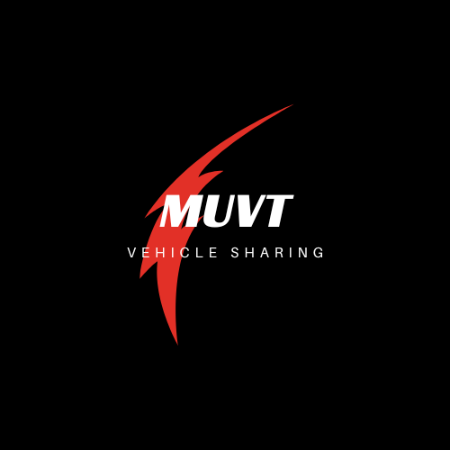

# Muvt - Vehicle Sharing

Questo programma si occupa della gestione di un'azienda di vehicle sharing, ovvero permette agli utenti registrati di affittare un veicolo (automobile, furgoncino, moto, macchina elettrica, monopattino elettrico, bicicletta).

[Traccia dell'esercizio](./files/TRACCIA.md)  
[Flowchart risolutivo](./files/muvt_flowchart.png)
